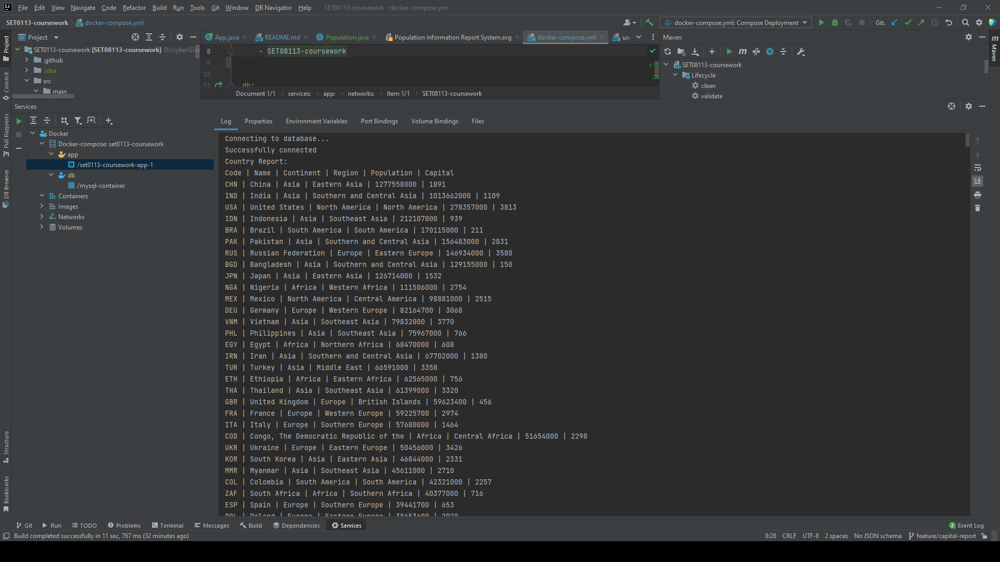
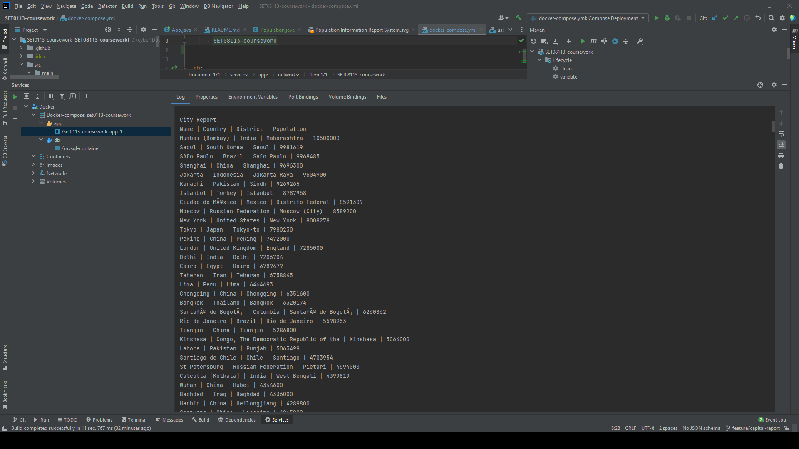
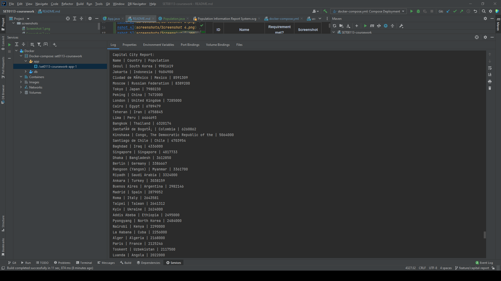
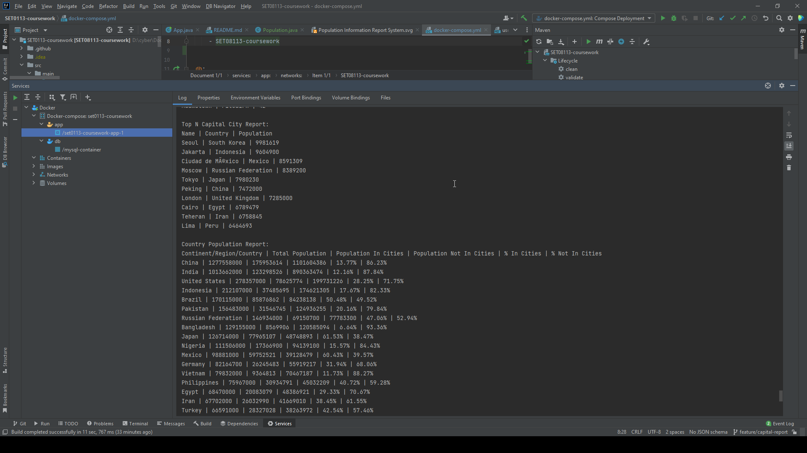
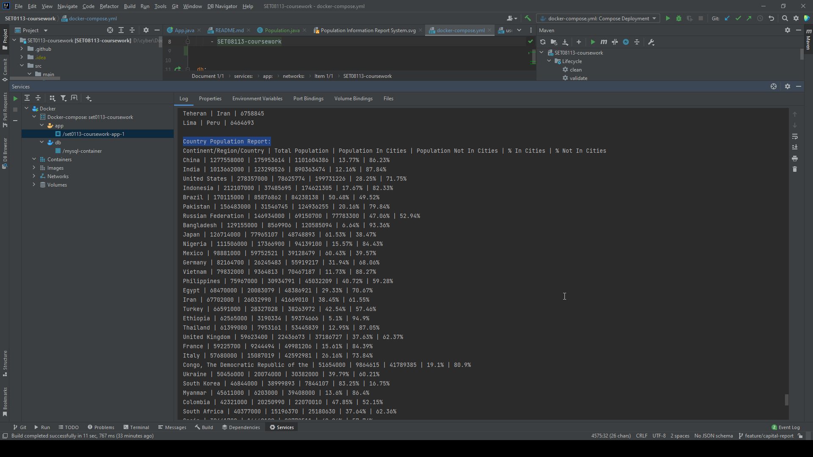
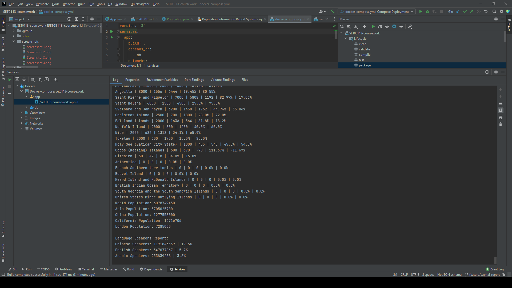

# Software Engineering Methods

- Master Build Status 

- Develop Build Status 

- License 

- Release 

| ID  | Name                                                                                                                       | Requirement met? | Screenshot                                    |
|-----|----------------------------------------------------------------------------------------------------------------------------|------------------|-----------------------------------------------|
| 1   | All the countries in the world organised by largest population to smallest.                                                | Yes              |  |
| 2   | All the cities in the world organised by largest population to smallest.                                                   | Yes              |  |
| 3   | All the capital cities in the world organised by largest population to smallest.                                           | Yes              |  |
| 4   | The top N populated capital cities in the world where N is provided by the user.                                           | Yes              |  |
| 5   | The population of people, people living in cities, and people not living in cities in each country.                        | Yes              |  |
| 6   | The number of people who speak Chinese from greatest number to smallest, including the percentage of the world population  | Yes              |  |
| 7   | The number of people who speak English from greatest number to smallest, including the percentage of the world population  | Yes              |  |
| 8   | The number of people who speak American from greatest number to smallest, including the percentage of the world population | Yes              |  |
